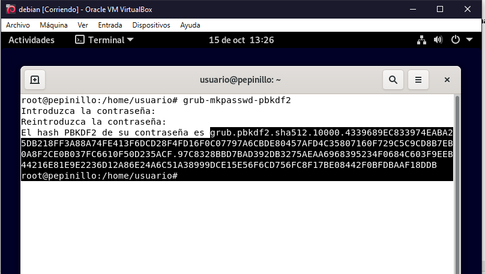

author: Nombre del autor
summary: Resumen del CodeLab
id: identificador-unico-del-codelab
categories: codelab,markdown
environments: Web
status: Published
feedback link: Un enlace en el que los usuarios puedan darte feedback (quizás creando un issue en un repositorio de git)
analytics account: ID de Google Analytics

 

# Forma segura de proteger tu sistema Ubuntu 
## Forma segura de proteger tu sistema Ubuntu 

### Ocultación del menú de arranque
##
##
Para poder ocultar primero el menú de arranque primero necesitamos modificar un parámetro de en el archivo **/etc/grub.d/30_os-prober** tenemos que cambiar el set time out a 0, esto es una funcion if que si el time out es igual a 0 antes se ponia a 5, pero con el cambio que hemos realizado que es cambiar el 5 por el 0 ahora no mostrara el grub.
##
##

~~~
**sudo nano /etc/grub.d/30_os-prober**
~~~

##
##

##
##
Ahora nos vamos al siguiente archivo que tenemos que modificar.
##
##
~~~
**Nano /Etc/Default/grup**
~~~
##
##
Y cambiamos el 
*GRUB_TIMEOUT=5 a 0*, 
Después hacemos un *sudo update-grub*.
##
##

##
##
Tambien en la instalación podemos seleccionar que no nos ponga el grub.

##
##
### Contraseña de arranque
##
##
Primero abrimos una terminal, Con **grub-mkpasswd-pbkdf2** escribiremos la contraseña que le querremos poner al arranque y nos dara el hash de esa contraseña para que sea cifrado
##
##

##
##

Ahora nos vamos al fichero **/boot/grub/grub.cfg**
Y añadiremos apartir de la línea 7 
##
~~~

**Set superusers=”admin”** 

**Password_pbkdf2 admin (y el hash de la contraseña copiada)**

~~~
##
##

##
##
ahora cuando reiniciemos
##
##

##
##
### Copia de seguridad DE LOS ARCHIVOS DE CONFIGURACION
##

~~~
**cp /boot/grub/grub/grub.cfg seguridad/grub.cfg.old**

**cp /etc/grub.d/00_header 00_header.old**

**cp /etc/grub.d/10_linux Seguridad/10_linux.old**

**cp /etc/grub.d/30_os-prober Seguridad/30_os-prober.old**

~~~
##
##

##
##
### mas formas de proteger tu sistema
##
##
Definir los usuarios y las contraseñas de los usuarios que podran modificar el grub
##
**sudo nano /etc/grub.d/00_header**

**cat << EOF**

**set superusers="root,joan"**

**password root 1234** 

**password joan 4321**

**EOF**
##
##
Proteger las entradas pertenecientes al sistema operativo principal.
##
##
#### Una instalacion segura
A la hora de la instalación es mejor no tener el equipo conectado a internet.
#
En el nombre de la maquina como recomendación si se va a tratar de un servidor web o un apache o un dns o cualquier otro servicio que puede ser vulnerable mejor ponerle un nombre aleatorio o que no tenga nada que ver.
#

##
Las contraseñas como recomendación por seguridad tener al mínimo 8 caracteres
##

##
A la hora de hacer la instalación del sistema operativo es recomendable hacer la partición del disco de forma manual
##

##
Tambien vamos a cifrar Las particiones en este caso la raíz y el home, No particionamos el boot sino no podremos arrancar.
##
Deberemos incluso ponerle una contraseña a los discos 
##

##
##
Aqui nos pide que pongamos una contraseña para los discos.
##
Ya lo demas es como la tipica instalacion
